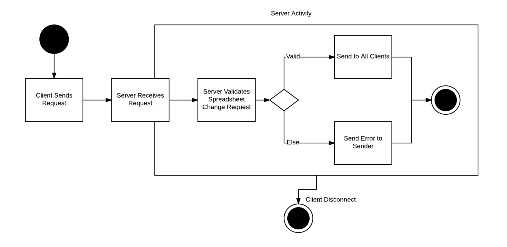

# STTP (Spreadsheet Text Transfer Protocol) Specification v1.0

### Jacob Badger, Gabriel Kerr, Daniel Merrell, Russell Kennington
### 4 March 2017
### Link to online version: https://github.com/arussellk/cs3505-spreadsheet-protocol/blob/master/README.md 


# Contents

* [Protocol Overview](#po)
* [Messages Overview](#mo)
* [Server to Client Messages](#stcm)
* [Client to Server Messages](#cstm)
* [Protocol Quick Reference](#pqr)

# <a name="po"></a> Protocol Overview

STTP follows the philosophy that "the server is the man".
That is, the server holds the state of the spreadsheet and clients can only request to make changes.
Clients are passive and only display what the server instructs.

Client requests are sent to the server. 
The server validates the requests in the order that they are received. 
Once the changes are applied to the server's spreadsheet, they are sent to all of the clients. 
Clients do NOT perform any validation.
Communication between the server and client is summarized below:

____

This diagram illustrates the initial connection between the server and client. 
During the last stage of the connection (Display/Deliver Spreadsheet), the server temporarily stops evaluating requests from other clients to ensure that the incoming client recieves the complete state of the spreadsheet. 
Once the connection is complete, the server continues evaluating the incoming requests.

<p align="center">
      
</p>

___

This diagram summarizes the server's process of receiving and evaluating incoming requests from the client. 
All requests are processed in the order that they are received. 

<p align="center">
      
</p>

___


> Note:  
If a client requests a change that would result in an error (e.g. circular dependencies, formula errors)
the change is not applied and an error message is sent to that client only.

> Note:  
Invalid commands sent between the server and the client are ignored.


# <a name="mo"></a>Messages Overview

All messages are sent as strings. Messages are delimited by spaces. Each message ends with a newline character (`\n`). All messages follow this generic format: 

```
<action> [<parameters>]
```

A complete list of all messages and their specific formats is documented below. 

# <a name="stcm"></a> Server to Client Messages

- `Error <cell> <message>`  
Informs a single client that their change to `<cell>` was rejected because of an error. `<message>` is a human-readable message which can be displayed to the user.  

    Example:
    ```
    Error A1 ERROR: The change would cause a circular dependency
    ```

- `Set <cell> [<formula>] <display_value>`

  This command has two forms.

  If the optional parameter `<formula>` is included,
then the client should show `<display_value>`
(the evaluated result of the formula)
and be able to edit `<formula>`.

    Example:
    ```
    Set A1 =A2+A3 100
    ```

  If `<formula>` is not included,
then the client should display and edit `<display_value>`.

    Examples:
    ```
    Set A1
    Set A1 10
    Set A1 foo bar
    ```

# <a name="cstm"></a>Client to server messages

- `Connect <username>`  
Connect to the server as `<username>`.  

    Example:
    ```
    Connect Bob Loblaw
    ```

- `Load <filename>`  
Load the file `<filename>`. If the file does not yet exist, the server will automatically create it.  

    Example:
    ```
    Load foo bar.sprd
    ```

- `TrySet <cell> <formula|number|plain_text>`  
Requests the server to change `<cell>` to the provided value.  
The value can be in one of three forms:  
  - `formula` must begin with `=`
  - `number` must be completely parsable as a float
  - `plain_text` is neither of the other forms

  Examples:

    ```
    TrySet A1 =A2 * B3
    TrySet A1 3.14
    TrySet A1
    TrySet A1 foo bar
    ```

- `Undo`  
Rolls back the most recent change on the document made by any client editing that document. It is possible that `Undo` does nothing. It is also possible that `Undo` reverts a change that the requesting client has not yet seen.  

    Example:
    ```
    Undo
    ```

# <a name="pqr"></a>Protocol Quick Reference

## Summary of Server to Client Messages

```
Error <cell> <message>
Set <cell> [<formula>] <display_value>
```

## Summary of Client to Server Messages

```
Connect <username>
Load <filename>
TrySet <cell> <formula|number|plain_text>
Undo
```
